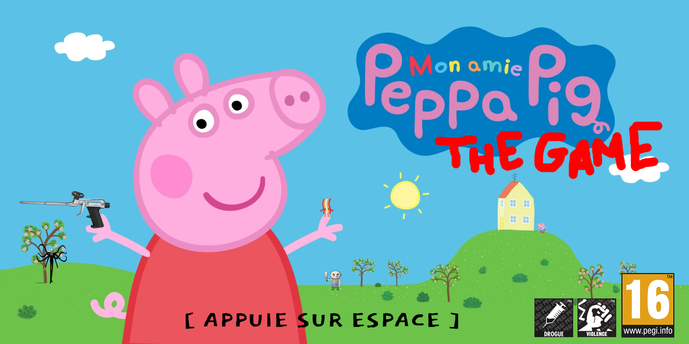

# Les Aventures de Peppa Pig - Projet So_Long 42

```
" I'm Peppa Pig! *Snort* - 🐷 "
```


Le but de ce projet est de créer un petit jeu en 2D dans lequel le célèbre personnage, ami de tous les enfants, Peppa Pig
cherche à tout prix du bacon pour en manger au goûter de 16h avec son frère George. Vous avez l'entière responsabilité de l'escorter
jusqu'à lui sans qu'elle puisse rencontrer le méchant et le machiavélique Dylan le Boucher... 

## ⚠️ Avertissement !

Avertissement : ce jeu comporte des scènes, des propos ou des images pouvant heurter la sensibilité des joueuses et des joueurs, malgré que le jeu semble être de tous publics (qui n'est pas vraiment le cas...)

## Comment ça marche ?

```bash
git clone https://github.com/vietdu91/42_so_long.git
bash ./so_long maps/[map au choix]
```

et... ENJOY !

